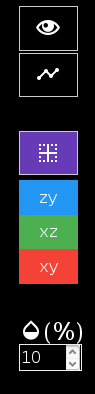

.. -*- coding: utf-8 -*-
.. raw:: html

  <link rel="icon" href="../../icons/favicon.ico">


===========================================
User Documentation
===========================================
------------------------------------------
Phantom |alpha| s Web Designer
------------------------------------------

:Author: Guillem González Vela, Emmanuel Caruyer - Firstname.Lastname\@irisa.fr
:License: `BSD 2-Clause License`_
:Source: Phantom |alpha| s Web Designer is on GitHub_

.. _BSD 2-Clause License: ../../LICENSE
.. _GitHub: https://github.com/ecaruyer/phantomas-web

Phantom |alpha| s Web Designer is a graphical interface for creation and
edition of phantoms
to be used in Phantom |alpha| s (`link`_ to Phantom |alpha| s' homepage).

.. _link: http://www.emmanuelcaruyer.com/phantomas.php

.. contents::
.. section-numbering::


Requirements
=====================
Phantom |alpha| s Web Designer was tested on
`Mozilla Firefox`_. Although, it is fully compatible
with any modern internet navigator.

No extra software is needed.

.. _Mozilla Firefox: http://www.firefox.com


Capabilities
=====================
Using this app you will be able to

  - Load or create from scratch any phantom model and save it as a
    JSON Phantom |alpha| s file
  - Visualize any phantom model and its structure and components individually
    in a lightweight, three-dimensional and fully interactive interface.
  - Add and remove fibers and isotropic regions in the phantom.
  - Change the position and the radius for any isotropic region
  - Edit the radius and the tangents' method for any fiber

  - Add, remove and edit the position of any control point in a fiber

Definition of a fiber bundle
-----------------------------

A fiber bundle in Phantom |alpha| s is defined as a cylindrical tube wrapped around
its centerline. The centerline itself is a continuous curve in
3D, and can be simply created from a few control points.

This app uses the same specifications as Phantom |alpha| s. More information
may be found in its documentation_.

.. _documentation: http://www.emmanuelcaruyer.com/phantomas/fiber_bundle.html


Basic Usage
=====================
.. contents:: :local:

Phantom |alpha| s Web Designer divides the window in three panels:

- Left panel allows you to navigate through the elements and edit them
- Central panel displays the fiber in a what-you-see-is-what-you-get manner.
  It is fully mouse interactive.

- Right panel lets the user tweak the display options.

.. image:: img/capture.png
    :width: 60%
    :align: center

Phantom overview
-----------------------
The largest panel displays the current phantom layout. At start, view is from
plane XY.

You may click to rotate, right-click to pan and use the mouse wheel to zoom.
The view may be restored at any time by using the `right panel`_
camera placements.

To identify and view the structure of individual phantom elements, you may use
the `left panel`_ element navigator.

Left panel
-----------------------
The left panel allows you to navigate between the different phantom elements.
You may also edit those, or add and remove.

To identify the different elements you may place your mouse over the selector
lists. Those will highlight while mouse is placed onto their selection option.
Highlighting elements for identifying will not affect the current task.

Edition mode
`````````````
When clicking onto an option, edition options will pop up and the element will
stay highlighted. To exit edition mode, select the *\*none\** option or press
*Esc*. Changes are saved once those take place.

To remove an element, you must access its edition mode.

Numeral inputs allow keyboard input, although it is restricted to valid values
and a 1-decimal precision by default.

Editing an Isotropic Region
```````````````````````````````````````


The editable elements in a region concern:

  - Its name
  - Its color
  - Its radius

  - Its position (x y z)

Name and color are editable from the title fields. Click to the square
representing the color for deploying color editing interface.

Drag and Drop interactive controls for editing the position of the isotropic
region can be deployed by clicking the button under the position fields.
When drag and drop controls are active it stays yellow (as shown in the picture)
and it can be turned off at any moment by clicking over again.

Editing a Fiber
```````````````````````````````````````


When entering fiber edition mode, its structure will feature in the scene.

The editable elements in a fiber concern:

  - Its name
  - Its color
  - Its radius

  - Its tangent-computing mode:

    + Symmetric
    + Incoming

    + Outgoing

Name and color are editable from the title fields. Click to the square
representing the color for deploying color editing interface.

A selection list for the fibers' control points is available
at the bottom.
Hovering those will also highglight them in the scene to help identifying.

Editing a Control Point
```````````````````````````````````````
Clicking over a control point in the list will pop up control
point edition mode.

.. image:: img/cpedit.png
    :align: center

Only position may be edited.

While editing and navigating through control points, those may adopt four
different colors in the scene:

  - *Yellow*: Control points the user is not interacting with.
  - *Blue*: For the control point being hovered in selection list.
  - *Red*: Currently being edited control point.

  - *Green*: Position changed control point that may be saved.

A control point is saved whenever its edition is quitted. When position was
changed, the former version is on the scene in red color while the one to
be saved is in green. The former may be recovered by pressing the *Undo* button,
marked with an arrow.

Position may be edited manually by using the given fields. As well, by clicking
on the *Drag and Drop* button, marked with a pointer. This option will allow an
interactive edition in the scene itself.


The interactive edition allows different liberty grades:

  - *Axes*, by using the arrows shown.
  - *Planes*, by dragging the planes formed between the arrows.

  - *The screen plane*, by clicking directly on the point.

*New CP* button creates a new control point. It is to be
placed in the mid-point between the current and the next one. *Remove CP*
removes the current control point after asking for confirmation.

*Remove CP* option is not available in first and last control points.

Right panel
-----------------------
Right panel concerns everything regarding the visualization.



Options are:

  - *Preview Switch*: Only available in editing mode.
    Allows the user to preview the phantom with any fade. Does not affect
    the edition. Unactive in the screenshot above.
  - *Skeleton Swith*: When activated, the whole skeleton structure for the
    phantom is shown at all times. Unactive in the screenshot above.
  - *Axes Switch*: Shows and hides the coordinates axis. Active
    in the screenshot above. Each axis features a different color:

    + Red for X
    + Green for Y
    + Blue for Z

  - *Position*: Move the scene to XY, XZ or ZY plane.

  - *Opacity*: Select [0 - 50%] the opacity of the faded elements.

Export Phantom
-----------------------
At bottom-right corner the export button allows you, at any moment, to download
the JSON file for the current phantom.

The file is compatible with Phantom |alpha| s and may be loaded as well in Phantom |alpha| s
Web Designer for further edition.

Keyboard Shortcuts
-----------------------
Keyboard shortcuts are available for most commonly used functions:

====  =============================================
Esc    Exit current edit
----  ---------------------------------------------
P      Switch preview mode
----  ---------------------------------------------
W      Switch skeleton structure
----  ---------------------------------------------
D      Switch drag and drop controls
----  ---------------------------------------------
A      Switch axes
----  ---------------------------------------------
X      Move to X=0 plane
----  ---------------------------------------------
Y      Move to Y=0 plane
----  ---------------------------------------------
Z      Move to Z=0 plane
----  ---------------------------------------------
S      Save phantom
----  ---------------------------------------------
U      Undo control point edition
----  ---------------------------------------------
Del    Remove current element
====  =============================================

Source Code
============================
Phantom |alpha| s Web Designer is open source and may be
`downloaded and forked on GitHub`_. Pull Requests are welcome!

.. _downloaded and forked on GitHub: https://github.com/ecaruyer/phantomas-web


.. raw:: html

  <center><br><br><br>

-----------------------------------------

This document was generated on |date| at |time|.


.. |alpha| unicode:: U+03B1 .. alpha
  :trim:

.. |date| date::
.. |time| date:: %H:%M
